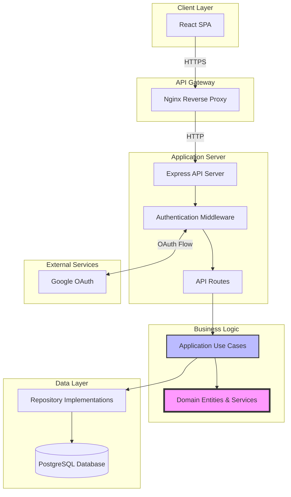
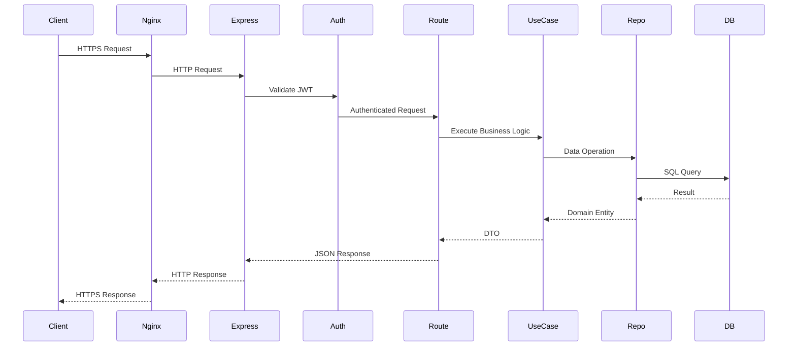
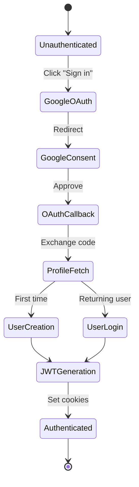
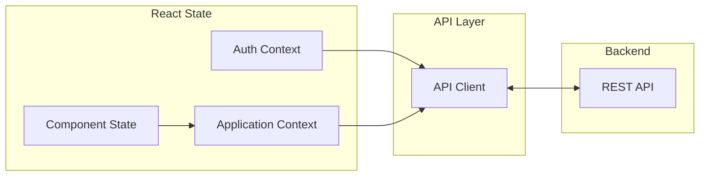
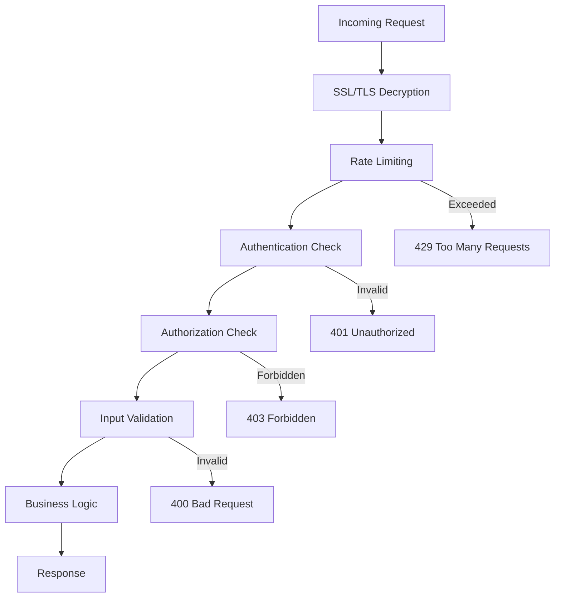
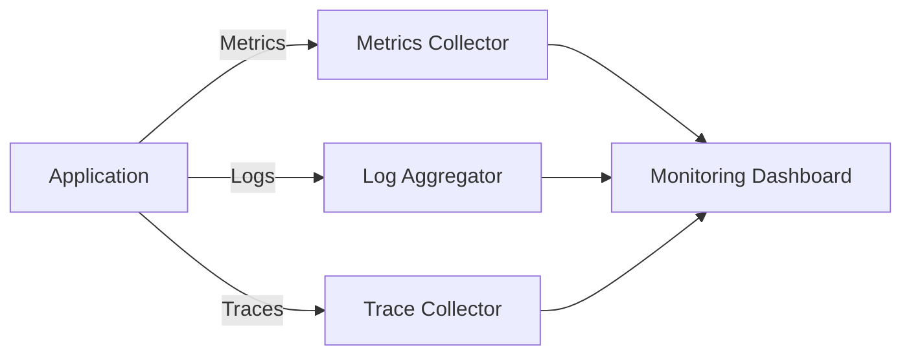
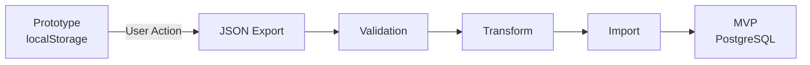

# MISC MVP Architecture Documentation

## System Overview

MISC MVP transforms the single-user prototype into a production-ready multi-user system while preserving the Clean Architecture principles and core business logic. The architecture maintains strict separation of concerns with well-defined boundaries between layers.

## Architecture Principles

1. **Clean Architecture** - Business logic independence from implementation details
2. **Domain-Driven Design** - Domain model drives the design
3. **Test-Driven Development** - Tests define contracts before implementation
4. **Dependency Inversion** - Dependencies point inward toward the domain
5. **SOLID Principles** - Each component has single responsibility
6. **Evolutionary Architecture** - Ready for future scaling

## System Architecture Diagram



## Layered Architecture (Clean Architecture)

```
┌──────────────────────────────────────────────┐
│                 Presentation                 │ ◀── User Interface
│          (React SPA, REST API)              │     External Interfaces
├──────────────────────────────────────────────┤
│                 Application                  │ ◀── Use Cases
│        (Business Operations, DTOs)          │     Orchestration
├──────────────────────────────────────────────┤
│                   Domain                     │ ◀── Entities & Business Rules
│      (Entities, Value Objects, Services)    │     Core Business Logic
├──────────────────────────────────────────────┤
│                Infrastructure               │ ◀── External Concerns
│   (Database, Auth, External Services)       │     Implementation Details
└──────────────────────────────────────────────┘

Dependencies flow inward: Infrastructure → Application → Domain
```

## Package Structure

```
misc-poc/
├── packages/
│   ├── domain/                 # Core Business Logic (unchanged)
│   │   ├── entities/           # Record, Tag
│   │   ├── value-objects/      # RecordId, TagId, RecordContent
│   │   ├── services/           # TagNormalizer, RecordMatcher
│   │   └── errors/             # Domain-specific errors
│   │
│   ├── application/            # Use Cases & Orchestration
│   │   ├── use-cases/          # CreateRecord, SearchRecords, etc.
│   │   ├── ports/              # Repository interfaces
│   │   ├── dto/                # Data Transfer Objects
│   │   └── services/           # Application services
│   │
│   ├── backend/                # NEW: API Server
│   │   ├── api/                # Express routes
│   │   ├── auth/               # Google OAuth, JWT
│   │   ├── middleware/         # Auth, validation, rate limiting
│   │   ├── repositories/       # PostgreSQL implementations
│   │   └── migrations/         # Database schema migrations
│   │
│   ├── presentation/
│   │   └── web/                # React Frontend
│   │       ├── components/     # UI components
│   │       ├── hooks/          # Custom React hooks
│   │       ├── services/       # API client
│   │       └── contexts/       # React contexts
│   │
│   └── shared/                 # Common utilities
│       ├── Result.ts           # Error handling
│       ├── UUID.ts             # ID generation
│       └── types/              # Shared TypeScript types
```

## Domain Layer

The domain layer remains completely unchanged from the prototype, preserving all business logic:

### Core Entities

- **Record**: Immutable entity representing user information
- **Tag**: Normalized searchable token

### Value Objects

- **RecordId**: UUID-based identity
- **TagId**: UUID-based tag identity
- **RecordContent**: Original user input
- **SearchQuery**: Normalized search terms

### Domain Services

- **TagNormalizer**: Consistent tag normalization
- **TagValidator**: Business rules validation
- **TagParser**: Content to tags conversion
- **RecordMatcher**: Search algorithm (AND logic)
- **RecordDuplicateChecker**: Uniqueness validation

## Application Layer

Enhanced with user context while preserving core logic:

### Use Cases

```typescript
// Prototype
CreateRecord.execute(content: string): Result<RecordDTO>

// MVP - Enhanced with user context
CreateRecord.execute(content: string, userId: UserId): Result<RecordDTO>
```

### Repository Ports (Interfaces)

```typescript
interface RecordRepository {
  save(record: Record, userId: UserId): Promise<Result<void>>;
  findByTags(tags: TagId[], userId: UserId): Promise<Record[]>;
  findById(id: RecordId, userId: UserId): Promise<Record | null>;
  delete(id: RecordId, userId: UserId): Promise<Result<void>>;
}
```

## Infrastructure Layer

### Database Architecture

```mermaid
erDiagram
    USERS ||--o{ RECORDS : owns
    USERS ||--|| USER_SETTINGS : has
    USERS ||--o{ SESSIONS : has

    USERS {
        uuid id PK
        string email UK
        string google_id UK
        string display_name
        string avatar_url
        timestamp created_at
        timestamp updated_at
        timestamp last_login_at
    }

    RECORDS {
        uuid id PK
        uuid user_id FK
        text content
        text[] tags
        text[] normalized_tags
        timestamp created_at
        timestamp updated_at
    }

    USER_SETTINGS {
        uuid user_id PK_FK
        boolean case_sensitive
        boolean remove_accents
        integer max_tag_length
        integer max_tags_per_record
        string ui_language
    }

    SESSIONS {
        uuid id PK
        uuid user_id FK
        string token_jti UK
        timestamp expires_at
        timestamp revoked_at
    }
```

### Repository Implementations

- **PostgreSQLRecordRepository**: Implements RecordRepository port
- **PostgreSQLTagRepository**: Implements TagRepository port
- **PostgreSQLUserRepository**: User management

### Performance Optimizations

- GIN index for array containment queries
- Connection pooling (20 connections)
- Prepared statements for common queries
- Query result caching strategy

## API Layer

### RESTful Endpoints

```
Authentication:
  POST   /auth/google           - Initiate OAuth
  GET    /auth/google/callback  - OAuth callback
  POST   /auth/refresh          - Refresh JWT token
  POST   /auth/logout           - Invalidate session

Records:
  GET    /api/records           - Search records
  POST   /api/records           - Create record
  GET    /api/records/:id       - Get specific record
  PUT    /api/records/:id       - Update record
  DELETE /api/records/:id       - Delete record

Tags:
  GET    /api/tags              - Tag statistics
  GET    /api/tags/suggest      - Auto-completion

Import/Export:
  GET    /api/export            - Export all data
  POST   /api/import            - Import data

User:
  GET    /api/user/profile      - User information
  GET    /api/user/settings     - User preferences
  PUT    /api/user/settings     - Update preferences

System:
  GET    /health                - Health check
```

### Request/Response Flow



## Authentication Architecture

### OAuth Flow



### Token Management

- **Access Token**: 15 minutes, for API authentication
- **Refresh Token**: 7 days, for session persistence
- **Storage**: httpOnly secure cookies
- **Rotation**: Automatic refresh before expiration

## Frontend Architecture

### Component Hierarchy

```
App
├── AuthProvider (Context)
│   ├── LoginPage
│   └── AuthenticatedApp
│       ├── ApplicationProvider (Use Cases)
│       │   ├── SearchInput
│       │   ├── RecordsList
│       │   ├── TagCloud
│       │   └── ImportExport
│       └── ErrorBoundary
```

### State Management



### Data Flow

1. **User Action** → Component Event Handler
2. **Use Case Invocation** → Via Application Context
3. **API Call** → Through API Client
4. **State Update** → Context or Local State
5. **UI Re-render** → React Reconciliation

## Deployment Architecture

### Container Architecture

```yaml
Services:
  nginx:
    - Reverse proxy
    - SSL termination
    - Static file serving
    - Request routing

  api:
    - Express server
    - Business logic
    - Database connections
    - Session management

  postgres:
    - Data persistence
    - User isolation
    - Transaction management

  redis (future):
    - Session cache
    - Rate limiting
    - Search cache
```

### Network Architecture

```
Internet
    │
    ▼
[Cloudflare/CDN]
    │
    ▼
[Load Balancer]
    │
    ▼
[Nginx:443]──SSL──┐
    │             │
    ▼             ▼
[API:3000]    [Static Files]
    │
    ▼
[PostgreSQL:5432]
```

## Security Architecture

### Defense in Depth

| Layer              | Security Measures                         |
| ------------------ | ----------------------------------------- |
| **Network**        | HTTPS, HSTS, CSP headers                  |
| **Application**    | JWT validation, CORS, Rate limiting       |
| **Business Logic** | Input validation, Sanitization            |
| **Data**           | Parameterized queries, Encryption at rest |
| **Infrastructure** | Docker isolation, Secrets management      |

### Security Flow



## Performance Architecture

### Caching Strategy

```
Browser Cache
    ├── Static Assets (1 year)
    ├── API Responses (Cache-Control headers)
    └── Service Worker (future)

Application Cache
    ├── Compiled Queries (prepared statements)
    ├── Connection Pool
    └── In-memory lookups

Database Cache
    ├── Query Plan Cache
    ├── Index Cache
    └── Shared Buffers
```

### Performance Targets

| Metric         | Target | Measurement Point   |
| -------------- | ------ | ------------------- |
| TTFB           | <200ms | Nginx logs          |
| FCP            | <1.5s  | Lighthouse          |
| TTI            | <3s    | Lighthouse          |
| API Response   | <200ms | Application metrics |
| Database Query | <50ms  | pg_stat_statements  |

## Scalability Path

### Current (MVP) - 100 users

```
Single Server:
  - Docker Compose
  - Single PostgreSQL
  - Local file storage
```

### Phase 2 - 1,000 users

```
Vertical Scaling:
  - Larger instance
  - PostgreSQL tuning
  - Redis cache
```

### Phase 3 - 10,000 users

```
Horizontal Scaling:
  - Kubernetes cluster
  - Read replicas
  - CDN for assets
  - Message queue
```

### Phase 4 - 100,000+ users

```
Distributed System:
  - Microservices
  - Sharded database
  - Event sourcing
  - Global CDN
```

## Monitoring and Observability

### Metrics Collection



### Key Metrics

- **Application**: Request rate, Error rate, Response time
- **Database**: Query time, Connection pool, Lock waits
- **Infrastructure**: CPU, Memory, Disk I/O, Network
- **Business**: Records created, Search queries, Active users

## Migration Architecture

### Data Migration Flow



### Compatibility Matrix

| Component       | Prototype      | MVP          | Changes Required     |
| --------------- | -------------- | ------------ | -------------------- |
| Domain Entities | ✅             | ✅           | None                 |
| Use Cases       | ✅             | ✅           | Add userId parameter |
| Repositories    | localStorage   | PostgreSQL   | New implementation   |
| Frontend        | Direct storage | API calls    | Add API client       |
| Authentication  | None           | Google OAuth | New layer            |

## Decision Records

### ADR-001: PostgreSQL over MongoDB

**Context**: Need multi-user data storage
**Decision**: PostgreSQL for relational data and array operations
**Consequences**: Better for structured queries, GIN indexes for arrays

### ADR-002: JWT over Server Sessions

**Context**: Need stateless authentication
**Decision**: JWT tokens with refresh rotation
**Consequences**: Scalable, no server state, requires token management

### ADR-003: Clean Architecture Preservation

**Context**: Successful prototype architecture
**Decision**: Keep domain and application layers unchanged
**Consequences**: Faster development, proven business logic

### ADR-004: Docker from Start

**Context**: Consistent development environment needed
**Decision**: Docker Compose for all services
**Consequences**: Reproducible setup, easy onboarding

### ADR-005: TDD Mandatory

**Context**: Maintain code quality
**Decision**: No production code without failing test
**Consequences**: Higher quality, slower initial development

## References

- [Clean Architecture - Robert C. Martin](https://blog.cleancoder.com/uncle-bob/2012/08/13/the-clean-architecture.html)
- [Domain-Driven Design - Eric Evans](https://www.domainlanguage.com/ddd/)
- [The Twelve-Factor App](https://12factor.net/)
- [PostgreSQL Performance](https://www.postgresql.org/docs/current/performance-tips.html)
- [JWT Best Practices](https://datatracker.ietf.org/doc/html/rfc8725)
