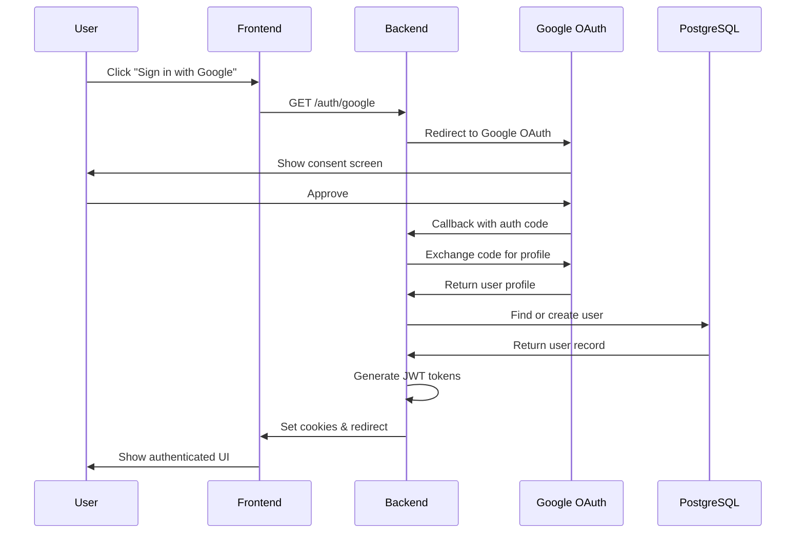

# MISC MVP Authentication & Authorization Guide

## Overview

This document describes the authentication and authorization architecture for MISC MVP, including Google OAuth 2.0 integration, JWT token management, and security requirements. Implementation details are left to developers following TDD approach.

## Authentication Architecture

### System Components

```
┌─────────────┐     ┌─────────────┐     ┌─────────────┐
│   Browser   │────▶│   Backend   │────▶│   Google    │
│   (React)   │◀────│  (Express)  │◀────│   OAuth     │
└─────────────┘     └─────────────┘     └─────────────┘
       │                   │
       │                   ▼
       │            ┌─────────────┐
       └───────────▶│  PostgreSQL │
                    │   (Users)   │
                    └─────────────┘
```

### Authentication Flow



## Google OAuth 2.0 Requirements

### OAuth Configuration

| Parameter         | Value                   | Purpose                     |
| ----------------- | ----------------------- | --------------------------- |
| **Client ID**     | From Google Console     | Application identifier      |
| **Client Secret** | From Google Console     | Secret for server-side auth |
| **Callback URL**  | `/auth/google/callback` | Return URL after auth       |
| **Scopes**        | `profile`, `email`      | Required user information   |
| **Access Type**   | `online`                | No offline access needed    |

### Required OAuth Endpoints

| Endpoint                | Method | Purpose               | Public |
| ----------------------- | ------ | --------------------- | ------ |
| `/auth/google`          | GET    | Initiate OAuth flow   | Yes    |
| `/auth/google/callback` | GET    | Handle OAuth response | Yes    |
| `/auth/logout`          | POST   | Invalidate session    | No     |

### User Data Extraction

From Google OAuth profile, extract:

- `googleId` - Unique identifier from Google
- `email` - Primary email address
- `displayName` - User's full name
- `avatarUrl` - Profile picture URL

## JWT Token Architecture

### Token Types

| Token             | Purpose                    | Lifetime   | Storage         |
| ----------------- | -------------------------- | ---------- | --------------- |
| **Access Token**  | API authentication         | 15 minutes | httpOnly cookie |
| **Refresh Token** | Generate new access tokens | 7 days     | httpOnly cookie |

### Token Payload Structure

```yaml
Access Token Claims:
  sub: User UUID
  email: User email
  iat: Issued at timestamp
  exp: Expiration timestamp
  type: 'access'

Refresh Token Claims:
  sub: User UUID
  jti: Unique token ID (for revocation)
  iat: Issued at timestamp
  exp: Expiration timestamp
  type: 'refresh'
```

### Token Security Requirements

1. **Signing Algorithm**: RS256 or HS256 with minimum 256-bit key
2. **Secret Keys**: Separate secrets for access and refresh tokens
3. **Key Rotation**: Support for key rotation without breaking existing sessions
4. **Revocation**: Ability to revoke specific refresh tokens

## Cookie Configuration

### Security Settings

| Setting      | Development | Production | Purpose                  |
| ------------ | ----------- | ---------- | ------------------------ |
| **httpOnly** | true        | true       | Prevent XSS access       |
| **secure**   | false       | true       | HTTPS only in production |
| **sameSite** | lax         | strict     | CSRF protection          |
| **domain**   | localhost   | .misc.com  | Cookie scope             |
| **path**     | /           | /          | Available to all routes  |

### Cookie Names and Expiration

| Cookie        | Name           | Max Age    | Purpose             |
| ------------- | -------------- | ---------- | ------------------- |
| Access Token  | `misc_access`  | 15 minutes | Short-lived auth    |
| Refresh Token | `misc_refresh` | 7 days     | Session persistence |

## Session Management

### Session Lifecycle

1. **Creation**: On successful Google OAuth
2. **Validation**: On every API request
3. **Refresh**: When access token expires
4. **Revocation**: On logout or security event

### Token Refresh Flow

```
1. Access token expires (401 response)
2. Frontend sends refresh token to /auth/refresh
3. Backend validates refresh token
4. Backend checks if token is revoked
5. Backend generates new access token
6. Backend updates cookies
7. Frontend retries original request
```

### Session Storage Requirements

Store in PostgreSQL `sessions` table:

- Token JTI (JWT ID) for revocation tracking
- User ID for session association
- Expiration time for cleanup
- Creation time for audit
- Revocation time if revoked

## Authorization Middleware

### Request Authentication Flow

```
1. Extract token from cookie
2. Verify token signature
3. Check token expiration
4. Extract user ID from token
5. Attach user context to request
6. Proceed to route handler
```

### Protected Routes

All routes except:

- `/health` - System health check
- `/auth/google` - OAuth initiation
- `/auth/google/callback` - OAuth callback
- `/auth/refresh` - Token refresh

### User Context

After authentication, attach to request:

- `userId` - User's UUID
- `email` - User's email
- `settings` - User's preferences

## Security Requirements

### Token Security

| Requirement            | Implementation         | Rationale             |
| ---------------------- | ---------------------- | --------------------- |
| **Minimum Key Length** | 256 bits               | Prevent brute force   |
| **Token Rotation**     | Every 15 minutes       | Limit exposure window |
| **Secure Storage**     | httpOnly cookies       | Prevent XSS attacks   |
| **HTTPS Only**         | Production requirement | Prevent MITM          |
| **Rate Limiting**      | 5 auth attempts/minute | Prevent brute force   |

### Attack Prevention

| Attack Type           | Mitigation Strategy                     |
| --------------------- | --------------------------------------- |
| **XSS**               | httpOnly cookies, CSP headers           |
| **CSRF**              | sameSite cookies, CSRF tokens           |
| **Session Hijacking** | Secure cookies, HTTPS, short expiration |
| **Token Replay**      | JTI tracking, expiration checks         |
| **Brute Force**       | Rate limiting, account lockout          |

### Security Headers

Required security headers:

- `Strict-Transport-Security: max-age=31536000`
- `X-Content-Type-Options: nosniff`
- `X-Frame-Options: DENY`
- `X-XSS-Protection: 1; mode=block`
- `Content-Security-Policy: default-src 'self'`

## Error Handling

### Authentication Errors

| Error          | HTTP Status | Response         | User Action     |
| -------------- | ----------- | ---------------- | --------------- |
| Invalid token  | 401         | `INVALID_TOKEN`  | Re-login        |
| Expired token  | 401         | `TOKEN_EXPIRED`  | Refresh token   |
| No token       | 401         | `NO_TOKEN`       | Login           |
| Invalid OAuth  | 400         | `OAUTH_ERROR`    | Retry OAuth     |
| User not found | 404         | `USER_NOT_FOUND` | Contact support |

### Error Response Format

```json
{
  "error": "TOKEN_EXPIRED",
  "message": "Access token has expired",
  "timestamp": "2025-01-01T10:00:00Z"
}
```

## Testing Requirements

### Unit Tests

- Token generation with correct claims
- Token validation (valid/invalid/expired)
- Cookie setting with security flags
- User creation from OAuth profile
- Session revocation logic

### Integration Tests

- Complete OAuth flow
- Token refresh flow
- Protected route access
- Session persistence
- Logout and cleanup

### E2E Tests

- User login through Google OAuth
- Session persistence across page refresh
- Automatic token refresh
- Logout flow
- Error handling for invalid tokens

### Security Tests

- XSS prevention verification
- CSRF token validation
- Rate limiting enforcement
- SQL injection prevention
- Token expiration enforcement

## Monitoring and Logging

### Authentication Metrics

Track and alert on:

- Failed login attempts per user
- Token refresh frequency
- Session duration statistics
- OAuth provider errors
- Unusual login patterns

### Audit Logging

Log all authentication events:

- Login attempts (success/failure)
- Token generation
- Token refresh
- Logout events
- Security violations

### Log Format

```json
{
  "timestamp": "ISO-8601",
  "event": "auth.login.success",
  "userId": "UUID",
  "ip": "IP address",
  "userAgent": "Browser info",
  "details": {}
}
```

## Migration from Prototype

### User Migration Strategy

1. **First login creates account**: No pre-migration needed
2. **Email as identifier**: Links to existing data if email matches
3. **Data import**: After authentication, user can import prototype data
4. **No password migration**: OAuth-only authentication

### Session Compatibility

- No session migration needed (prototype had no auth)
- Clean slate for all users
- Import preserves data, not sessions

## Future Enhancements

### Planned Features

| Feature                     | Priority | Complexity |
| --------------------------- | -------- | ---------- |
| Email/password auth         | Medium   | Medium     |
| 2FA support                 | High     | Low        |
| Social logins (GitHub, etc) | Low      | Low        |
| SSO for enterprises         | Low      | High       |
| Biometric auth              | Low      | Medium     |

### Scalability Considerations

- Redis for session storage (when >1000 concurrent users)
- JWT signing key rotation automation
- Distributed session management
- Rate limiting with Redis
- OAuth provider failover

## Compliance Requirements

### GDPR Compliance

- Right to deletion (include sessions)
- Data portability (include auth method)
- Consent tracking for OAuth
- Audit trail of authentication

### Security Standards

- OWASP Authentication guidelines
- OAuth 2.0 RFC 6749 compliance
- JWT RFC 7519 compliance
- HTTPS everywhere (RFC 2818)

## References

- [Google OAuth 2.0 Documentation](https://developers.google.com/identity/protocols/oauth2)
- [JWT Best Practices RFC 8725](https://datatracker.ietf.org/doc/html/rfc8725)
- [OWASP Authentication Cheat Sheet](https://cheatsheetseries.owasp.org/cheatsheets/Authentication_Cheat_Sheet.html)
- [Passport.js Documentation](http://www.passportjs.org/docs/)
