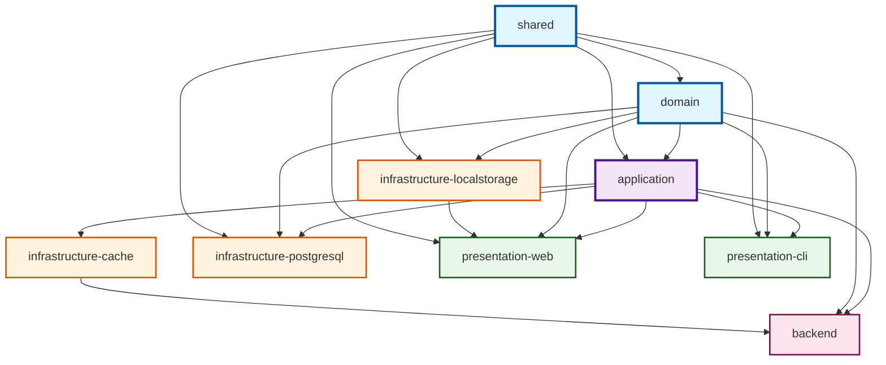
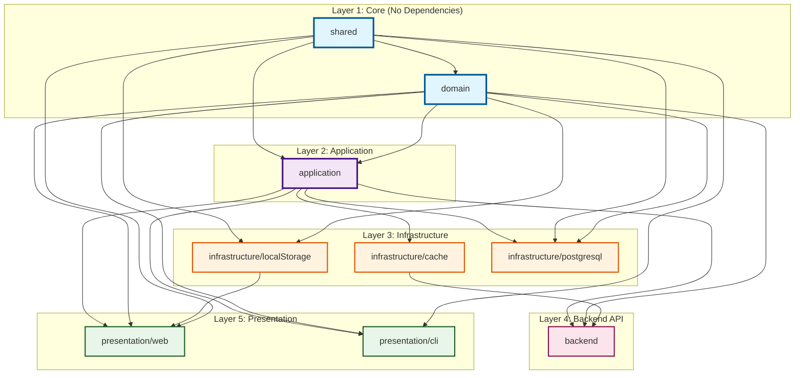

# Package Dependency Diagram

## Architecture Overview

This project follows **Clean Architecture** principles with clear dependency rules flowing inward from presentation → application → domain.

## Layer-Based View

## Detailed Package Information

### Layer 1: Core (Foundation)

#### 1. **shared** (`@misc-poc/shared`)

- **Path**: `packages/shared`
- **Dependencies**: None
- **Purpose**: Common utilities, types, and helpers used across all packages
- **Dependents**: domain, application, infrastructure/localStorage, infrastructure/postgresql, presentation/web, presentation/cli

#### 2. **domain** (`@misc-poc/domain`)

- **Path**: `packages/domain`
- **Dependencies**:
  - `@misc-poc/shared`
- **Purpose**: Domain entities, value objects, and business rules
- **Dependents**: application, infrastructure/localStorage, infrastructure/postgresql, backend, presentation/web, presentation/cli

### Layer 2: Application

#### 3. **application** (`@misc-poc/application`)

- **Path**: `packages/application`
- **Dependencies**:
  - `@misc-poc/domain`
  - `@misc-poc/shared`
- **Purpose**: Use cases, application services, and repository interfaces
- **Dependents**: infrastructure/cache, infrastructure/postgresql, backend, presentation/web, presentation/cli

### Layer 3: Infrastructure

#### 4. **infrastructure/cache** (`@misc-poc/infrastructure-cache`)

- **Path**: `packages/infrastructure/cache`
- **Dependencies**:
  - `@misc-poc/application`
- **Purpose**: Caching implementations (Redis, in-memory)
- **Dependents**: backend

#### 5. **infrastructure/localStorage** (`@misc-poc/infrastructure-localstorage`)

- **Path**: `packages/infrastructure/localStorage`
- **Dependencies**:
  - `@misc-poc/domain`
  - `@misc-poc/shared`
- **Purpose**: Browser localStorage repository implementation
- **Dependents**: presentation/web

#### 6. **infrastructure/postgresql** (`@misc-poc/infrastructure-postgresql`)

- **Path**: `packages/infrastructure/postgresql`
- **Dependencies**:
  - `@misc-poc/application`
  - `@misc-poc/domain`
  - `@misc-poc/shared`
- **Purpose**: PostgreSQL repository implementations and migrations
- **Dependents**: None (used at runtime by backend)

### Layer 4: Backend API

#### 7. **backend** (`@misc-poc/backend`)

- **Path**: `packages/backend`
- **Dependencies**:
  - `@misc-poc/application`
  - `@misc-poc/domain`
  - `@misc-poc/infrastructure-cache`
- **Purpose**: Express API server, authentication, routes, middleware
- **Dependents**: None (top-level server)

### Layer 5: Presentation

#### 8. **presentation/web** (`@misc-poc/presentation-web`)

- **Path**: `packages/presentation/web`
- **Dependencies**:
  - `@misc-poc/application`
  - `@misc-poc/domain`
  - `@misc-poc/infrastructure-localstorage`
  - `@misc-poc/shared`
- **Purpose**: React SPA with Vite
- **Dependents**: None (top-level UI)

#### 9. **presentation/cli** (`@misc-poc/presentation-cli`)

- **Path**: `packages/presentation/cli`
- **Dependencies**:
  - `@misc-poc/application`
  - `@misc-poc/domain`
  - `@misc-poc/shared`
- **Purpose**: Command-line interface
- **Dependents**: None (top-level CLI)

## Dependency Rules

### ✅ Allowed Dependencies

1. **Shared** → No dependencies (foundation layer)
2. **Domain** → Shared only
3. **Application** → Domain, Shared
4. **Infrastructure** → Application, Domain, Shared (implements application interfaces)
5. **Backend** → Application, Domain, Infrastructure/Cache
6. **Presentation** → Application, Domain, Infrastructure, Shared

### ❌ Forbidden Dependencies

- **No circular dependencies** between packages
- **Domain** MUST NOT depend on Application or Infrastructure
- **Application** MUST NOT depend on Infrastructure or Presentation
- **Infrastructure** MUST NOT depend on Backend or Presentation
- **Shared** MUST remain dependency-free

## Build Order

Due to dependencies, packages must be built in this order:

1. **shared** (no dependencies)
2. **domain** (depends on shared)
3. **application** (depends on domain, shared)
4. **infrastructure/cache** (depends on application)
5. **infrastructure/localStorage** (depends on domain, shared)
6. **infrastructure/postgresql** (depends on application, domain, shared)
7. **backend** (depends on application, domain, infrastructure/cache)
8. **presentation/cli** (depends on application, domain, shared)
9. **presentation/web** (depends on application, domain, infrastructure/localStorage, shared)

## Dependency Graph Statistics

- **Total Packages**: 9
- **Zero Dependencies**: 1 (shared)
- **Core Layer**: 2 packages (shared, domain)
- **Application Layer**: 1 package
- **Infrastructure Layer**: 3 packages
- **Backend Layer**: 1 package
- **Presentation Layer**: 2 packages

## Architecture Compliance

This architecture follows:

- ✅ **Clean Architecture** - Dependencies point inward
- ✅ **Dependency Inversion Principle** - Application defines interfaces, infrastructure implements
- ✅ **Single Responsibility** - Each package has a clear purpose
- ✅ **Separation of Concerns** - Domain logic separated from infrastructure
- ✅ **Testability** - Infrastructure can be mocked via application interfaces

## Legend

- 🔵 **Blue** (Core Layer): Foundation with no external dependencies
- 🟣 **Purple** (Application Layer): Business logic and use cases
- 🟠 **Orange** (Infrastructure Layer): Technical implementations
- 🔴 **Pink** (Backend Layer): API and server
- 🟢 **Green** (Presentation Layer): User interfaces
