# Task Dependency Diagram

```mermaid
graph TD
    %% Main tasks
    T1[1: Backend Package Setup]
    T2[2: PostgreSQL Docker]
    T3[3: Migration System]
    T4[4: User Domain Entity]
    T5[5: Google OAuth Flow]
    T6[6: PostgreSQL User Repo]
    T7[7: Auth Middleware & Routes]
    T8[8: PostgreSQL Record Repo]
    T9[9: Records CRUD API]
    T10[10: Tag Statistics API]
    T11[11: User Profile API]
    T12[12: Export/Import API]
    T13[13: API Security]
    T14[14: Frontend API Client]
    T15[15: Frontend Auth]
    T16[16: Frontend Error Handling]
    T17[17: Production Docker]
    T18[18: Backup System]
    T19[19: Migration Tool]
    T20[20: E2E Testing]

    %% Main task dependencies
    T1 --> T2
    T2 --> T3
    T4 --> T5
    T3 --> T6
    T4 --> T6
    T5 --> T7
    T6 --> T7
    T3 --> T8
    T7 --> T9
    T8 --> T9
    T8 --> T10
    T6 --> T11
    T7 --> T11
    T8 --> T12
    T7 --> T13
    T9 --> T13
    T9 --> T14
    T10 --> T14
    T11 --> T14
    T14 --> T15
    T14 --> T16
    T2 --> T17
    T13 --> T17
    T2 --> T18
    T3 --> T18
    T8 --> T19
    T12 --> T19
    T15 --> T20
    T16 --> T20

    %% Subtasks for Task 1
    T1_1[1.1: Backend Directory]
    T1_2[1.2: Express + TypeScript]
    T1_3[1.3: PostgreSQL Client]
    T1_4[1.4: OAuth Dependencies]
    T1_5[1.5: Validation & Testing]

    T1_1 --> T1_2
    T1_1 --> T1_3
    T1_1 --> T1_4
    T1_2 --> T1_5
    T1_3 --> T1_5
    T1_4 --> T1_5

    %% Subtasks for Task 2
    T2_1[2.1: Docker Compose]
    T2_2[2.2: Environment Vars]
    T2_3[2.3: Volumes & Network]
    T2_4[2.4: Test DB Config]
    T2_5[2.5: Health Checks]
    T2_6[2.6: DB Init Scripts]

    T2_1 --> T2_2
    T2_1 --> T2_3
    T2_2 --> T2_4
    T2_3 --> T2_4
    T2_2 --> T2_5
    T2_3 --> T2_5
    T2_4 --> T2_6
    T2_5 --> T2_6

    %% Subtasks for Task 3
    T3_1[3.1: TypeORM Config]
    T3_2[3.2: Users Table]
    T3_3[3.3: Records Table]
    T3_4[3.4: Settings Table]
    T3_5[3.5: Migration Runner]
    T3_6[3.6: Checksum Validation]
    T3_7[3.7: CI/CD Integration]

    T3_1 --> T3_2
    T3_2 --> T3_3
    T3_2 --> T3_4
    T3_3 --> T3_5
    T3_4 --> T3_5
    T3_5 --> T3_6
    T3_6 --> T3_7

    %% Subtasks for Task 4
    T4_1[4.1: User Aggregate]
    T4_2[4.2: GoogleId VO]
    T4_3[4.3: UserSettings VO]
    T4_4[4.4: Auth Context]
    T4_5[4.5: User Factory]
    T4_6[4.6: Contract Compatibility]

    T4_2 --> T4_4
    T4_1 --> T4_5
    T4_2 --> T4_5
    T4_3 --> T4_5
    T4_1 --> T4_6
    T4_4 --> T4_6
    T4_5 --> T4_6

    %% Subtasks for Task 5
    T5_1[5.1: OAuth Client Config]
    T5_2[5.2: Passport.js Setup]
    T5_3[5.3: JWT Token]
    T5_4[5.4: Refresh Token]
    T5_5[5.5: Cookie Handling]
    T5_6[5.6: Session Middleware]
    T5_7[5.7: Error Handling]
    T5_8[5.8: Integration Tests]

    T5_1 --> T5_2
    T5_2 --> T5_3
    T5_3 --> T5_4
    T5_4 --> T5_5
    T5_5 --> T5_6
    T5_6 --> T5_7
    T5_7 --> T5_8

    %% Subtasks for Task 6
    T6_1[6.1: Repo Interface]
    T6_2[6.2: findByGoogleId]
    T6_3[6.3: User Creation]
    T6_4[6.4: updateSettings]
    T6_5[6.5: Connection Pooling]
    T6_6[6.6: Error Handling]

    T6_1 --> T6_2
    T6_1 --> T6_3
    T6_2 --> T6_4
    T6_3 --> T6_4
    T6_2 --> T6_5
    T6_3 --> T6_5
    T6_4 --> T6_6
    T6_5 --> T6_6

    %% Subtasks for Task 7
    T7_1[7.1: JWT Middleware]
    T7_2[7.2: OAuth Callback]
    T7_3[7.3: Token Refresh]
    T7_4[7.4: Logout Route]
    T7_5[7.5: Validation]
    T7_6[7.6: CORS Config]
    T7_7[7.7: Security Headers]

    T7_1 --> T7_2
    T7_1 --> T7_3
    T7_1 --> T7_4
    T7_2 --> T7_5
    T7_3 --> T7_5
    T7_4 --> T7_5
    T7_5 --> T7_7
    T7_6 --> T7_7

    %% Subtasks for Task 8
    T8_1[8.1: CRUD Operations]
    T8_2[8.2: DB Schema]
    T8_3[8.3: Tag Search GIN]
    T8_4[8.4: User Isolation]
    T8_5[8.5: Tag Statistics]
    T8_6[8.6: Batch Operations]
    T8_7[8.7: Contract Compat]

    T8_2 --> T8_3
    T8_2 --> T8_4
    T8_2 --> T8_5
    T8_3 --> T8_5
    T8_1 --> T8_6
    T8_3 --> T8_6
    T8_1 --> T8_7
    T8_3 --> T8_7
    T8_4 --> T8_7
    T8_5 --> T8_7
    T8_6 --> T8_7

    %% Subtasks for Task 9
    T9_1[9.1: GET/POST /records]
    T9_2[9.2: GET/PUT/DELETE /:id]
    T9_3[9.3: Validation]
    T9_4[9.4: Search & Filter]
    T9_5[9.5: Rate Limiting]
    T9_6[9.6: Duplicate Detection]
    T9_7[9.7: Error Handling]

    T9_1 --> T9_2
    T9_1 --> T9_3
    T9_2 --> T9_3
    T9_1 --> T9_4
    T9_1 --> T9_5
    T9_2 --> T9_5
    T9_1 --> T9_6
    T9_3 --> T9_6
    T9_1 --> T9_7
    T9_2 --> T9_7
    T9_3 --> T9_7
    T9_4 --> T9_7
    T9_5 --> T9_7
    T9_6 --> T9_7

    %% Subtasks for Task 10
    T10_1[10.1: GET /tags Stats]
    T10_2[10.2: GET /tags/suggest]
    T10_3[10.3: Efficient Queries]
    T10_4[10.4: User Isolation]
    T10_5[10.5: Caching]
    T10_6[10.6: Prefix Matching]

    T10_1 --> T10_3
    T10_2 --> T10_3
    T10_1 --> T10_4
    T10_2 --> T10_4
    T10_3 --> T10_5
    T10_4 --> T10_5
    T10_2 --> T10_6
    T10_3 --> T10_6

    %% Subtasks for Task 11
    T11_1[11.1: GET /profile]
    T11_2[11.2: GET /settings]
    T11_3[11.3: PUT /settings]
    T11_4[11.4: Schema Validation]
    T11_5[11.5: Normalization]

    T11_1 --> T11_2
    T11_2 --> T11_3
    T11_3 --> T11_4
    T11_4 --> T11_5

    %% Subtasks for Task 12
    T12_1[12.1: Format Schemas]
    T12_2[12.2: GET /export]
    T12_3[12.3: POST /import]
    T12_4[12.4: Duplicate Detection]
    T12_5[12.5: Progress Reporting]
    T12_6[12.6: File Size Limits]
    T12_7[12.7: Error Recovery]

    T12_1 --> T12_2
    T12_1 --> T12_3
    T12_3 --> T12_4
    T12_2 --> T12_5
    T12_3 --> T12_5
    T12_3 --> T12_6
    T12_4 --> T12_7
    T12_5 --> T12_7
    T12_6 --> T12_7

    %% Subtasks for Task 13
    T13_1[13.1: Rate Limiting]
    T13_2[13.2: Input Sanitization]
    T13_3[13.3: Security Headers]
    T13_4[13.4: Error Format]
    T13_5[13.5: SQL Injection]
    T13_6[13.6: Logging]
    T13_7[13.7: Security Testing]

    T13_1 --> T13_6
    T13_4 --> T13_6
    T13_1 --> T13_7
    T13_2 --> T13_7
    T13_3 --> T13_7
    T13_4 --> T13_7
    T13_5 --> T13_7

    %% Subtasks for Task 14
    T14_1[14.1: HTTP Client]
    T14_2[14.2: Auth Handling]
    T14_3[14.3: Token Refresh]
    T14_4[14.4: Replace LocalStorage]
    T14_5[14.5: Loading States]
    T14_6[14.6: Optimistic Updates]
    T14_7[14.7: Retry Logic]
    T14_8[14.8: Offline Detection]

    T14_1 --> T14_2
    T14_2 --> T14_3
    T14_3 --> T14_4
    T14_4 --> T14_5
    T14_5 --> T14_6
    T14_6 --> T14_7
    T14_7 --> T14_8

    %% Subtasks for Task 15
    T15_1[15.1: OAuth Client Lib]
    T15_2[15.2: Login/Logout UI]
    T15_3[15.3: Auth State Mgmt]
    T15_4[15.4: Protected Routes]
    T15_5[15.5: Session Persistence]
    T15_6[15.6: Profile UI]
    T15_7[15.7: E2E Tests]

    T15_1 --> T15_2
    T15_1 --> T15_3
    T15_3 --> T15_4
    T15_3 --> T15_5
    T15_3 --> T15_6
    T15_5 --> T15_6
    T15_2 --> T15_7
    T15_4 --> T15_7
    T15_6 --> T15_7

    %% Subtasks for Task 16
    T16_1[16.1: Error Boundaries]
    T16_2[16.2: Loading Spinners]
    T16_3[16.3: Toast Notifications]
    T16_4[16.4: Network Errors]
    T16_5[16.5: Offline Detection]
    T16_6[16.6: Graceful Degradation]

    T16_1 --> T16_6
    T16_3 --> T16_6
    T16_4 --> T16_6

    %% Subtasks for Task 17
    T17_1[17.1: Prod Dockerfile]
    T17_2[17.2: Nginx Proxy]
    T17_3[17.3: SSL/TLS]
    T17_4[17.4: Env Mgmt]
    T17_5[17.5: Health Checks]
    T17_6[17.6: Documentation]

    T17_1 --> T17_2
    T17_2 --> T17_3
    T17_1 --> T17_4
    T17_1 --> T17_5
    T17_2 --> T17_5
    T17_3 --> T17_6
    T17_4 --> T17_6
    T17_5 --> T17_6

    %% Subtasks for Task 18
    T18_1[18.1: pg_dump Scripts]
    T18_2[18.2: Rotation Policy]
    T18_3[18.3: Integrity Checks]
    T18_4[18.4: Point-in-Time Recovery]
    T18_5[18.5: Restore Testing]
    T18_6[18.6: Monitoring]

    T18_1 --> T18_2
    T18_1 --> T18_3
    T18_1 --> T18_4
    T18_3 --> T18_5
    T18_4 --> T18_5
    T18_2 --> T18_6
    T18_3 --> T18_6

    %% Subtasks for Task 19
    T19_1[19.1: CLI Architecture]
    T19_2[19.2: LocalStorage Read]
    T19_3[19.3: User Creation]
    T19_4[19.4: Tag Normalization]
    T19_5[19.5: Duplicate Detection]
    T19_6[19.6: Batch Processing]
    T19_7[19.7: Progress Reporting]

    T19_1 --> T19_2
    T19_1 --> T19_3
    T19_2 --> T19_4
    T19_3 --> T19_5
    T19_4 --> T19_5
    T19_5 --> T19_6
    T19_6 --> T19_7

    %% Subtasks for Task 20
    T20_1[20.1: Playwright Setup]
    T20_2[20.2: OAuth E2E Tests]
    T20_3[20.3: API Contract Tests]
    T20_4[20.4: Multi-User Tests]
    T20_5[20.5: Performance Tests]
    T20_6[20.6: Edge Cases]
    T20_7[20.7: Export/Import E2E]

    T20_1 --> T20_2
    T20_1 --> T20_3
    T20_2 --> T20_4
    T20_3 --> T20_4
    T20_3 --> T20_5
    T20_2 --> T20_6
    T20_3 --> T20_6
    T20_4 --> T20_7

    %% Styling
    classDef done fill:#90EE90,stroke:#2E8B57,stroke-width:2px
    classDef inProgress fill:#FFD700,stroke:#DAA520,stroke-width:2px
    classDef pending fill:#E0E0E0,stroke:#808080,stroke-width:2px

    class T1,T2,T3,T4,T5,T6 done
    class T1_1,T1_2,T1_3,T1_4,T1_5 done
    class T2_1,T2_2,T2_3,T2_4,T2_5,T2_6 done
    class T3_1,T3_2,T3_3,T3_4,T3_5,T3_6,T3_7 done
    class T4_1,T4_2,T4_3,T4_4,T4_5,T4_6 done
    class T5_1,T5_2,T5_3,T5_4,T5_5,T5_6,T5_7,T5_8 done
    class T6_1,T6_2,T6_3,T6_4,T6_5,T6_6 done
    class T7,T7_1 inProgress
    class T8,T9,T10,T11,T12,T13,T14,T15,T16,T17,T18,T19,T20 pending
```

## Legend

- 🟢 **Green**: Completed tasks
- 🟡 **Yellow**: In progress tasks
- ⚪ **Gray**: Pending tasks

## Key Dependencies Overview

### Foundation Layer

1. **Task 1** (Backend Setup) → **Task 2** (PostgreSQL Docker) → **Task 3** (Migrations)
2. **Task 4** (User Domain) runs in parallel with infrastructure setup

### Authentication Layer

3. **Task 4** (User Domain) + **Task 3** (Migrations) → **Task 6** (User Repository)
4. **Task 4** → **Task 5** (OAuth) → **Task 7** (Auth Middleware)
5. **Task 6** + **Task 5** → **Task 7** (Auth routes complete)

### Data Layer

6. **Task 3** (Migrations) → **Task 8** (Record Repository)
7. **Task 7** + **Task 8** → **Task 9** (Records API)

### API Layer

8. **Task 8** → **Task 10** (Tag API)
9. **Task 6** + **Task 7** → **Task 11** (User Profile API)
10. **Task 8** → **Task 12** (Export/Import API)
11. **Task 7** + **Task 9** → **Task 13** (Security)

### Frontend Integration

12. **Task 9** + **Task 10** + **Task 11** → **Task 14** (API Client)
13. **Task 14** → **Task 15** (Frontend Auth)
14. **Task 14** → **Task 16** (Error Handling)

### Production & Testing

15. **Task 2** + **Task 13** → **Task 17** (Production Docker)
16. **Task 2** + **Task 3** → **Task 18** (Backup System)
17. **Task 8** + **Task 12** → **Task 19** (Migration Tool)
18. **Task 15** + **Task 16** → **Task 20** (E2E Testing)

## Current Status

- **Completed**: Tasks 1-6 (all subtasks)
- **In Progress**: Task 7.1 (JWT validation middleware)
- **Next**: Complete Task 7 (Authentication Middleware and Routes)
